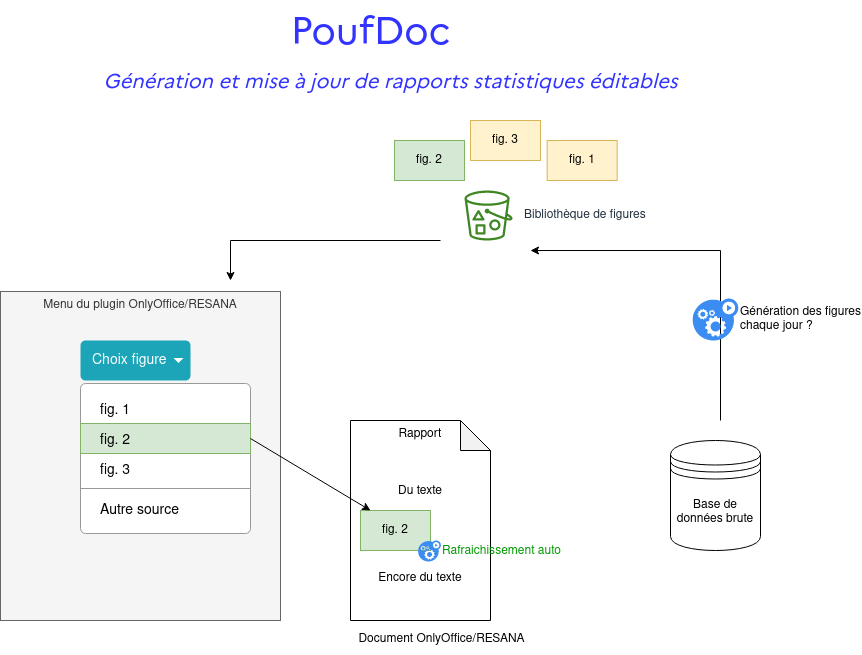

## PoufDoc

Génération et mise à jour de rapports statistiques éditables.

### Premier périmètre

Premier périmètre réduit pour avoir un résultat atteignable:
- insérer des images
- images hébergées en ligne (sur S3 ou publique)
- le doc va chercher ces images en ligne et les met à jour

### A éclaircir

Les points suivants sont à traiter/explorer pour démarrer:
- comment générer ces images ? Assez libre: R, Python, Dash, ...
- où stocker ces données ? Stockage S3, Minio sur [SSPCloud](https://datalab.sspcloud.fr/catalog/ide)
- comment lister les images dispos dans la bibliothèque ? Fichier de configuration qui liste les images et leur titre
- comment développer le plugin ? Dev web onlyOffice (cf [la doc](https://api.onlyoffice.com/plugin/basic))
- rafraichir une image **déjà insérée dans un doc**, est-ce possible ? A tester

###  Prochaines étapes court terme

Premiers tests à réaliser:
- trouver des images en ligne déjà dispo et mises à jour régulièrement. 
	- Exemple dashboard covid génère déjà des png: [cas dans le monde](https://raw.githubusercontent.com/CovidTrackerFr/covidtracker-data/master/images/charts/cases.jpeg)
	- Exemple dashboard covid génère déjà des png: [cas en France](https://raw.githubusercontent.com/CovidTrackerFr/covidtracker-data/master/images/charts/france/dashboard_jour.jpeg)
	- autres exemples ?
